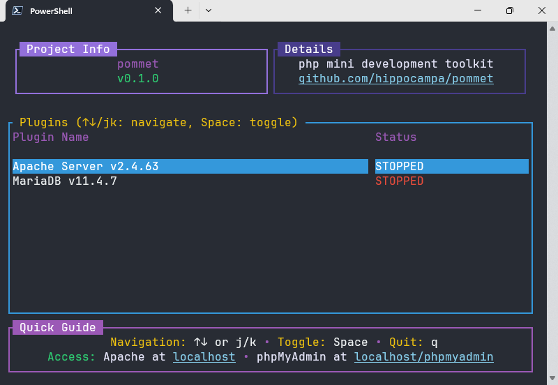

<br />
<div align="center">
<pre>
··············································
:                                            :
:                                       _    :
:  _ __   ___  _ __ ___  _ __ ___   ___| |_  :
: | '_ \ / _ \| '_ ` _ \| '_ ` _ \ / _ \ __| :
: | |_) | (_) | | | | | | | | | | |  __/ |_  :
: | .__/ \___/|_| |_| |_|_| |_| |_|\___|\__| :
: |_|                                        :
:                                            :
··············································
</pre>
<h3 align="center">pommet</h3>

  <p align="center">
    Toolkit Pengembangan PHP Lokal yang Ringan
    <br />
    <a href="https://github.com/hippocampa/pommet/issues/new?labels=bug&template=bug-report---.md">Laporkan Bug</a>
    &middot;
    <a href="https://github.com/hippocampa/pommet/issues/new?labels=enhancement&template=contribute-feature---.md">Berkontribusi</a>
  </p>
</div>

> [!NOTE]
> Dokumentasi ini ditulis dalam Bahasa Indonesia. [Klik di sini](docs/README_EN.md) untuk versi bahasa Inggris.

---
<div align="center">



</div>

## Tentang Pommet

Pommet adalah alternatif ringan untuk XAMPP yang dirancang khusus untuk pengembangan PHP di Windows. Berbeda dengan solusi serupa yang cenderung berat dan memakan banyak resource, Pommet hadir dengan pendekatan minimalis tanpa mengorbankan fungsionalitas yang diperlukan.

Pommet mengelola komponen-komponen berikut:
- Apache HTTP Server (v2.4.63)
- PHP (v8.4.7)
- MariaDB (v11.4.7)
- phpMyAdmin (v5.2.2)

Aplikasi ini dibangun menggunakan Rust dengan antarmuka terminal yang sederhana namun efektif untuk mengelola seluruh layanan pengembangan lokal Anda.

### Status Pengembangan

Pommet saat ini masih dalam tahap pengembangan awal dengan versi 0.x. Hal ini berarti:

- Belum direkomendasikan untuk lingkungan produksi
- Cocok untuk pengembangan aplikasi skala kecil hingga menengah
- Ideal untuk pembelajaran dan eksperimen
- Stabil untuk kebutuhan pengembangan sehari-hari

---

## Mengapa Memilih Pommet

### Penggunaan Resource yang Efisien
Pommet dirancang dengan prinsip minimalis. Aplikasi ini hanya menggunakan resource yang benar-benar diperlukan, berbeda dengan alternatif lain yang sering kali membawa komponen-komponen yang tidak terpakai.

### Instalasi Otomatis
Seluruh proses instalasi dan konfigurasi dilakukan secara otomatis. Anda tidak perlu repot mengunduh dan mengatur setiap komponen secara manual.

### Konfigurasi yang Sudah Siap Pakai
Semua layanan telah dikonfigurasi untuk bekerja bersama tanpa konflik. Anda dapat langsung mulai mengembangkan aplikasi tanpa harus melalui proses troubleshooting yang merepotkan.

### Antarmuka yang Bersih
Terminal interface yang sederhana namun powerful memungkinkan Anda mengelola semua layanan dari satu tempat dengan navigasi keyboard yang intuitif.

---

## Panduan Instalasi

### Persyaratan Sistem
- Sistem operasi Windows 10 atau 11
- Koneksi internet untuk mengunduh komponen
- Hak akses administrator (hanya untuk instalasi)

### Pilihan Instalasi

Pilih salah satu metode instalasi berikut:

#### Opsi 1: PowerShell (Otomatis)
Buka PowerShell sebagai administrator dan jalankan:

```powershell
# Buat direktori pommet
New-Item -ItemType Directory -Force -Path "C:\pommet"

# Download executable terbaru
$url = "https://github.com/hippocampa/pommet/releases/latest/download/pommet.exe"
Invoke-WebRequest -Uri $url -OutFile "C:\pommet\pommet.exe"

# Tambahkan ke PATH
$currentPath = [Environment]::GetEnvironmentVariable("PATH", "User")
if ($currentPath -notlike "*C:\pommet*") {
    [Environment]::SetEnvironmentVariable("PATH", "$currentPath;C:\pommet", "User")
}

Write-Host "Instalasi selesai! Restart terminal dan jalankan 'pommet' untuk memulai."
```

#### Opsi 2: Command Prompt (Otomatis)
Buka Command Prompt sebagai administrator dan jalankan:

```cmd
:: Buat direktori pommet
mkdir C:\pommet

:: Download executable (membutuhkan curl yang tersedia di Windows 10+)
curl -L -o C:\pommet\pommet.exe https://github.com/hippocampa/pommet/releases/latest/download/pommet.exe

:: Tambahkan ke PATH
setx PATH "%PATH%;C:\pommet" /M

echo Instalasi selesai! Restart terminal dan jalankan 'pommet' untuk memulai.
```

#### Opsi 3: Download Manual
1. Kunjungi halaman [GitHub Releases](https://github.com/hippocampa/pommet/releases)
2. Unduh file `pommet.exe` dari rilis terbaru
3. Buat folder `C:\pommet` dan pindahkan file `pommet.exe` ke dalamnya
4. Tambahkan `C:\pommet` ke PATH environment variable:
   - Buka System Properties → Advanced → Environment Variables
   - Pilih PATH di User variables → Edit
   - Tambahkan `C:\pommet` ke daftar
5. Restart terminal dan jalankan `pommet`

### Setelah Instalasi

Setelah instalasi selesai:
1. Buka terminal baru (Command Prompt atau PowerShell) - tidak perlu sebagai administrator
2. Jalankan perintah `pommet`
3. Biarkan Pommet mengunduh dan menginstal semua komponen secara otomatis
4. Aplikasi siap digunakan

> **Catatan**: Setelah terinstal, Pommet dapat dijalankan tanpa hak administrator. Hak admin hanya diperlukan saat instalasi awal.

### Cara Penggunaan

Jalankan Pommet dan gunakan shortcut keyboard untuk mengontrol layanan:

***tobeconfirmed***

### Akses Layanan

Setelah layanan berjalan, Anda dapat mengakses:

| Layanan | Alamat | Keterangan |
|---------|--------|------------|
| Web server | http://localhost/ | Server pengembangan utama |
| phpMyAdmin | http://localhost/phpmyadmin | Antarmuka manajemen database |
| MariaDB | Port 3306 | Koneksi database langsung |
| User default | root (tanpa password) | Kredensial database |

---

## Konfigurasi

Jika Anda perlu melakukan penyesuaian, berikut adalah lokasi file konfigurasi:

```
C:/pommet/bin/
├── Apache24/conf/httpd.conf
├── php8/php.ini
├── mariadb-11.4.7-winx64/my.ini
└── Apache24/htdocs/phpMyAdmin-5.2.2-english/config.inc.php
```

Pastikan untuk membuat backup sebelum melakukan perubahan pada file konfigurasi, dan restart layanan yang terkait setelah melakukan modifikasi.

---

## Pengembangan

### Membangun dari Source Code

Untuk membangun Pommet dari source code, pastikan Rust sudah terinstal di sistem Anda:

```bash
# Clone repository
git clone https://github.com/hippocampa/pommet.git
cd pommet

# Build project
cargo build --release

# Jalankan aplikasi
./target/release/pommet.exe
```

---

## Kontribusi

Proyek ini masih membutuhkan bantuan pengembangan dalam beberapa area:

### Area yang Membutuhkan Bantuan
- Pembaruan dokumentasi berbahasa inggris
- Implementasi log realtime seperti yang ada di XAMPP
- Deteksi otomatis untuk layanan yang masih berjalan
- Refaktoring trait Plugin, kemungkinan memerlukan trait Toggleable

### Cara Berkontribusi
1. Fork repository ini
2. Buat branch untuk fitur baru
3. Commit perubahan Anda
4. Push ke branch yang dibuat
5. Buat Pull Request

### Melaporkan Bug
Jika Anda menemukan bug, silakan buat issue baru dengan menyertakan:
- Versi sistem operasi dan spesifikasi
- Langkah-langkah untuk mereproduksi bug
- Perilaku yang diharapkan vs yang terjadi
- Screenshot jika diperlukan

---

## Lisensi

Proyek ini didistribusikan di bawah Lisensi MIT. Lihat file `LICENSE` untuk informasi lengkap.

---

## Penghargaan

Terima kasih kepada proyek-proyek open source yang membuat Pommet menjadi mungkin:

- [Apache HTTP Server](https://httpd.apache.org/) - Web server yang handal
- [PHP](https://www.php.net/) - Bahasa pemrograman web yang powerful
- [MariaDB](https://mariadb.org/) - Sistem manajemen database yang cepat
- [phpMyAdmin](https://www.phpmyadmin.net/) - Antarmuka manajemen database berbasis web
- [Rust](https://www.rust-lang.org/) - Bahasa pemrograman yang aman dan cepat

---

<div align="center">
  <p>Berikan <a href="https://github.com/hippocampa/pommet/stargazers">bintang</a> untuk Pommet!</p>
</div>